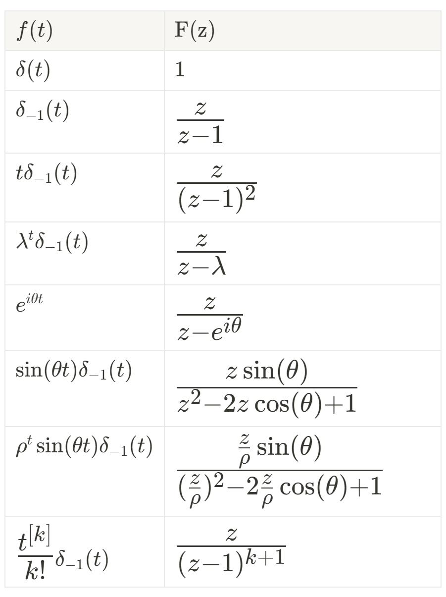

layout: post
title: "Trasformata Zeta"
categories: TdS
tags: Control Egineering
---
# Definizione della Trasformata Zeta

La trasformata Zeta di un segnale a tempo discreto x[n] è definita come:

$$
F(z) = \mathcal{Z}\{f(t)\} = \sum_{t=0}^{\infty} f(t)z^{-t}
$$

dove z è una variabile complessa.

<!--excerpt-->

## Proprietà Principali

### Dimostrazione delle Proprietà

$$
\begin{align*}
\text{Linearità: } \mathcal{Z}\{\alpha f(t) + \beta g(t)\} &= \alpha F(z) + \beta G(z)\\
\text{Anticipo unitario:  } \mathcal{Z}\{f(t + 1)\} &= zF(z) - zf(0)\\ \\
\text{Ritardo unitario:  } \mathcal{Z}\{f(t-1)\} &= z^{-1}F(z) \\ \\
\text{Somma di convoluzione: } \mathcal{Z}\{\sum_{\tau = 0}^{t-1} W(t-\tau)u(\tau) \} &= W(z)U(z) \\ \\
\text{Moltiplicazione per t: } \mathcal{Z}\{tf(t)\} &= -z \frac{d}{dz}F(z) \\ \\
\text{prodotto per } \lambda^t \text{: } \mathcal{Z}\{\lambda^tf(t)\} &= F(\frac{z}{\lambda})
\end{align*}
$$

### 1. Anticipo Unitario

Per dimostrare la proprietà dell'anticipo unitario:

$$
\begin{align*}
\mathcal{Z}\{f(t+1)\} &= \sum_{t=0}^{\infty} f(t+1)z^{-t} \\
&= z\sum_{t=0}^{\infty} f(t+1)z^{-(t+1)} \\
&= z[\sum_{t=1}^{\infty} f(t)z^{-t}] \\
&= z[F(z) - f(0)] \\
&= zF(z) - zf(0)
\end{align*}
$$

### 2. Ritardo Unitario

Per il ritardo unitario:

$$
\begin{align*}
\mathcal{Z}\{f(t-1)\} &= \sum_{t=0}^{\infty} f(t-1)z^{-t} \\
&= z^{-1}\sum_{t=0}^{\infty} f(t-1)z^{-(t-1)} \\
&= z^{-1}F(z)
\end{align*}
$$

### 3. Somma di Convoluzione

Per la somma di convoluzione, partiamo dalla definizione:

$$
\begin{align*}
\mathcal{Z}\{\sum_{\tau = 0}^{t-1} W(t-\tau)u(\tau)\} &= \sum_{t=0}^{\infty} [\sum_{\tau = 0}^{t-1} W(t-\tau)u(\tau)]z^{-t}
\end{align*}
$$

Scambiando l'ordine delle sommatorie:

$$
\begin{align*}
&= \sum_{\tau = 0}^{\infty} \sum_{t=\tau+1}^{\infty} W(t-\tau)u(\tau)z^{-t}
\end{align*}
$$

Facciamo il cambio di variabile k = t-τ:

$$
\begin{align*}
&= \sum_{\tau = 0}^{\infty} \sum_{k=1}^{\infty} W(k)u(\tau)z^{-(k+\tau)} \\
&= \sum_{\tau = 0}^{\infty} u(\tau)z^{-\tau} \sum_{k=1}^{\infty} W(k)z^{-k}
\end{align*}
$$

Riconosciamo le trasformate Z:

$$
\begin{align*}
&= [\sum_{\tau = 0}^{\infty} u(\tau)z^{-\tau}][\sum_{k=0}^{\infty} W(k)z^{-k}] \\
&= U(z)W(z)
\end{align*}
$$

Questo dimostra che la trasformata Z della convoluzione è il prodotto delle trasformate.

### 4. Moltiplicazione per t

Per la moltiplicazione per t, dobbiamo prima calcolare la trasformata zeta e poi derivarla:

$$
\begin{align*}
\mathcal{Z}\{tf(t)\} &= \sum_{t=0}^{\infty} tf(t)z^{-t}
\end{align*}
$$

Possiamo riscrivere questo come:

$$
\begin{align*}
\sum_{t=0}^{\infty} tf(t)z^{-t} &= \sum_{t=0}^{\infty} t \cdot f(t)z^{-t} \\
&= -z \cdot \sum_{t=0}^{\infty} f(t) \cdot \frac{d}{dz}(z^{-t})
\end{align*}
$$

Ora, osserviamo che:

$$
\begin{align*}
\frac{d}{dz}(z^{-t}) &= -t z^{-t-1}
\end{align*}
$$

Quindi:

$$
\begin{align*}
-z \cdot \sum_{t=0}^{\infty} f(t) \cdot \frac{d}{dz}(z^{-t}) &= -z\frac{d}{dz}[\sum_{t=0}^{\infty} f(t)z^{-t}] \\
&= -z\frac{d}{dz}F(z)
\end{align*}
$$

### 5. Prodotto per λᵗ

Per il prodotto per λᵗ:

$$
\begin{align*}
\mathcal{Z}\{\lambda^tf(t)\} &= \sum_{t=0}^{\infty} \lambda^tf(t)z^{-t} \\
&= \sum_{t=0}^{\infty} f(t)(\frac{\lambda}{z})^t \\
&= F(\frac{z}{\lambda})
\end{align*}
$$

## Calcolo dettagliato delle Trasformate Zeta

### 1. Impulso unitario δ(t)

L'impulso unitario è definito come:

$$
\delta(t) = \begin{cases} 1 & t = 0 \\ 0 & t \neq 0 \end{cases}
$$

Quindi la trasformata zeta è:

$$
\begin{align*}
F(z) &= \sum_{t=0}^{\infty} \delta(t)z^{-t} \\
&= \delta(0)z^0 + \delta(1)z^{-1} + \delta(2)z^{-2} + ... \\
&= 1 + 0 + 0 + ... \\
&= 1
\end{align*}
$$

### 2. Gradino unitario δ₋₁(t)

Il gradino unitario è definito come:

$$
\delta_{-1}(t) = \begin{cases} 1 & t \geq 0 \\ 0 & t < 0 \end{cases}
$$

La trasformata zeta diventa:

$$
\begin{align*}
F(z) &= \sum_{t=0}^{\infty} z^{-t} \\
&= 1 + z^{-1} + z^{-2} + z^{-3} + ... \\
&= \frac{1}{1-z^{-1}} \\
&= \frac{z}{z-1}
\end{align*}
$$

### 3. Rampa tδ₋₁(t)

Usando la proprietà della moltiplicazione per t:

$$
\begin{align*}
\mathcal{Z}\{tf(t)\} &= -z\frac{d}{dz}F(z) \\
&= -z\frac{d}{dz}(\frac{z}{z-1}) \\
&= -z[\frac{z-1-z}{(z-1)^2}] \\
&= -z[\frac{-1}{(z-1)^2}] \\
&= \frac{z}{(z-1)^2}
\end{align*}
$$

### 4. Esponenziale λᵗδ₋₁(t)

Calcoliamo direttamente la serie:

$$
\begin{align*}
F(z) &= \sum_{t=0}^{\infty} \lambda^t z^{-t} \\
&= \sum_{t=0}^{\infty} (\frac{\lambda}{z})^t \\
&= \frac{1}{1-\frac{\lambda}{z}} \quad \text{(serie geometrica con }|\frac{\lambda}{z}| < 1) \\
&= \frac{z}{z-\lambda}
\end{align*}
$$

### 5. Esponenziale complesso $e^{iθt}$

È un caso particolare del precedente con λ = e^{iθ}:

$$
\begin{align*}
F(z) &= \sum_{t=0}^{\infty} e^{i\theta t} z^{-t} \\
&= \frac{z}{z-e^{i\theta}}
\end{align*}
$$

### 6. Seno sin(θt)δ₋₁(t)

Usando la formula di Eulero:

$$
\begin{align*}
\sin(\theta t) &= \frac{e^{i\theta t} - e^{-i\theta t}}{2i} \\
F(z) &= \mathcal{Z}\{\sin(\theta t)\delta_{-1}(t)\} \\
&= \frac{1}{2i}[\frac{z}{z-e^{i\theta}} - \frac{z}{z-e^{-i\theta}}] \\
&= \frac{z\sin(\theta)}{z^2 - 2z\cos(\theta) + 1}
\end{align*}
$$

### 7. Seno smorzato ρᵗsin(θt)δ₋₁(t)

Applicando la proprietà del prodotto per ρᵗ al risultato precedente:

$$
\begin{align*}
F(z) &= \mathcal{Z}\{\rho^t\sin(\theta t)\delta_{-1}(t)\} \\
&= F(\frac{z}{\rho}) \\
&= \frac{\frac{z}{\rho}\sin(\theta)}{(\frac{z}{\rho})^2 - 2\frac{z}{\rho}\cos(\theta) + 1}
\end{align*}
$$

### 8. Potenza t^[k]/k!

Ricordiamo che 

$$
t^{[k]}=t(t-1)\cdots(t-k+1)
$$

Dimostrazione per induzione:

Base: per k = 0 abbiamo il gradino unitario, già dimostrato essere z/(z-1)

Passo induttivo: assumiamo che per k sia vero F(z) = z/(z-1)^(k+1)

$$
\begin{align*}
\mathcal{Z}\{\frac{t^{[k+1]}}{(k+1)!}\} &= \mathcal{Z}\{\frac{t}{k+1} \cdot \frac{t^{[k]}}{k!}\} \\
&= -\frac{z}{k+1}\frac{d}{dz}[\frac{z}{(z-1)^{k+1}}] \\
&= \frac{z}{(z-1)^{k+2}}
\end{align*}
$$

Che completa la dimostrazione per induzione.
